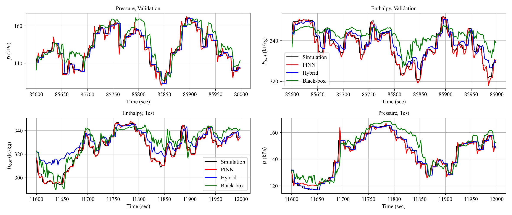
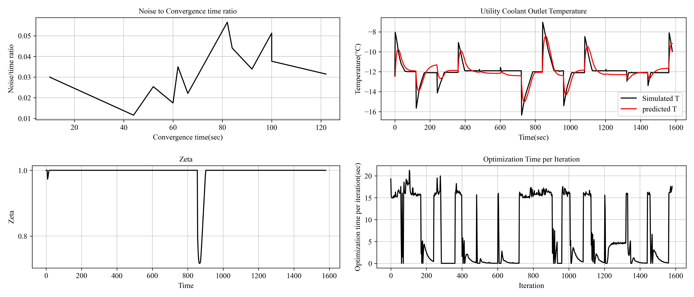

# PINN-MPC for VCC Evaporator Control

A PyTorch + MATLAB/Simulink implementation of a Physics-Informed Neural Network (PINN)-based Model Predictive Control (MPC) framework for vapor compression cycle (VCC) evaporators. 

By embedding first-principles ODEs derived from Moving Boundary models into neural networks, this approach delivers accurate and robust control without solving ODEs in real time applications.

Moving Boundary modeled ODEs are derived and written in casadi framework by Jisung Byun, alongside with MATLAB-Simulink simulation data for heat exchanger evaporators.

## How to use

```bash
# Install Python dependencies, and download data
bash scripts/setup.sh

# Train or test real time MPC. This requires real-time SIMULINK-pytorch MPC interface based on CSV file exchange. Contact author if needed.
bash scripts/dev.sh
```

## Results

Modeling Results, are compared with vanilla-LSTM, hybrid-modeled predictions provided by Jisung Byun. 
The PINN model provide better predictions for the system in terms of enthalpy and pressure outlet of refrigerants.


Optimizatio Results, are successful in control accuracy, but requires 15 seconds of optimization calculation for one time interval(requires optimization for every two seconds in real applications.)
This is due to missing GPU acceleration, for the MPC framework could not be applied in GPU servers, and are calculated on Macbook Air M2 processor.
Training of the PINN was based on A100 40GB.
